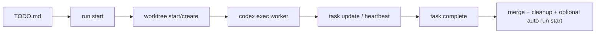

# codex-tasks


<p align="center">
  
  
  <br/>
  
  
  
</p>

<p align="center">
  
  
  
</p>

`codex-tasks` is a unified orchestration CLI for teams running parallel coding agents.
It provides an orchestration layer between worker launch and task completion:

- scheduler-ready task selection from `TODO.md`
- lock + PID based runtime safety
- explicit finish flow (`task complete`) for merge + cleanup
- interactive dashboard with emergency controls

## Start here: Codex skill (recommended)

This repo ships an installable Codex skill.

- skill manifest: `skills/.curated/codex-tasks/SKILL.md`
- installer path: `skills/.curated/codex-tasks`

Install with Codex skill installer:

In Codex, invoke `$skill-installer` with:

```text
$skill-installer Install skill from GitHub:
- repo: jaycho46/codex-tasks
- path: skills/.curated/codex-tasks
```

After install, restart Codex to pick up the skill.

If `codex-tasks` is not on PATH yet, bootstrap it with the canonical installer:

```bash
REPO="${CODEX_TASKS_REPO:-jaycho46/codex-tasks}"; curl -fsSL "https://raw.githubusercontent.com/${REPO}/main/scripts/install-codex-tasks.sh" | bash -s -- --repo "$REPO" --version "${CODEX_TASKS_VERSION:-latest}" --force
```

Use it as the default workflow:

1. In Codex task prompts, include `$codex-tasks` to apply guardrails.
2. For scheduled runs, start tasks with `codex-tasks run start`.
3. Monitor and control execution with `codex-tasks` (TUI).

## Why codex-tasks

`codex-tasks` is opinionated about the full task lifecycle:

1. Start work from the scheduler (`run start`)
2. Track ownership and heartbeat with explicit runtime state
3. Finish with merge strategy + cleanup guardrails (`task complete`)

This is designed to reduce common multi-agent failure modes: duplicate starts, owner collisions, stale locks, and "done but not merged."

## 60-second quickstart

```bash
# 1) Initialize task domain and state hygiene
codex-tasks init

# 2) Create a TODO task + spec template in one command
codex-tasks task new T1-001 "Implement app shell bootstrap"

# 3) Fill Goal/In Scope/Acceptance Criteria in tasks/specs/T1-001.md

# 4) Start ready tasks from TODO.md
codex-tasks run start

# 5) Open live dashboard (default command = status --tui)
codex-tasks
```

Interactive TUI requires:

```bash
python3 -m pip install textual
```

## Install with curl

Quick install:

```bash
curl -fsSL https://raw.githubusercontent.com/jaycho46/codex-tasks/main/scripts/install-codex-tasks.sh | bash
```

Default install paths:

- payload: `~/.local/share/codex-tasks/<version>/scripts`
- launcher: `~/.local/bin/codex-tasks`

## Entry point

```bash
codex-tasks [--repo <path>] [--state-dir <path>] [--config <path>] <command>
```

No command defaults to the interactive dashboard (`status --tui`).

## System flow



## Command surface

### Status and dashboard

```bash
codex-tasks
codex-tasks dashboard [--trigger <label>] [--max-start <n>]
codex-tasks status [--json|--tui] [--trigger <label>] [--max-start <n>]
```

What you get:

- scheduler readiness and excluded tasks (with reasons)
- runtime state counts and lock snapshots
- TUI controls: run start (`r`), emergency stop (`e`), tab switch (`1` / `2`)
- Task tab row action: select a task and press `Enter` to open its spec file
- Running Agents row action: select (`Enter`) or click to open session overlay
- Session overlay: read-only live tmux pane capture (legacy non-tmux sessions are shown as unsupported)
- auto-refresh every 2 seconds
- automatic fallback to text mode for non-interactive runs (CI/tests)

### Task domain

```bash
codex-tasks init [--gitignore <ask|yes|no>]
codex-tasks task init [--gitignore <ask|yes|no>]
codex-tasks task lock <agent> <scope> [task_id]
codex-tasks task unlock <agent> <scope>
codex-tasks task heartbeat <agent> <scope>
codex-tasks task update <agent> <task_id> <status> <summary>
codex-tasks task new <task_id> [--deps <task_id[,task_id...]>] <summary>
codex-tasks task complete <agent> <scope> <task_id> [--summary <text>] [--trigger <label>] [--no-run-start] [--merge-strategy <ff-only|rebase-then-ff>]
codex-tasks task scaffold-specs [--task <id>] [--dry-run] [--force]
codex-tasks task stop (--task <id> | --owner <owner> | --all) [--reason <text>] [--apply]
codex-tasks task cleanup-stale [--apply]
codex-tasks task emergency-stop [--reason <text>] [--yes]
codex-tasks emergency-stop [--reason <text>] [--yes]
```

Behavior notes:

- `init` (alias: `task init`) manages `.gitignore` for state path (`ask` default, `yes`, `no`)
- `task complete` does not create commits
- `task complete` requires fully committed worktree and `DONE` task status
- `task new` appends a TODO row and creates `tasks/specs/<task_id>.md` in one step
- `task new --deps` records prerequisite task ids in the `Deps` column
- `task scaffold-specs` creates `tasks/specs/<task_id>.md` templates from TODO items
- default merge strategy is `rebase-then-ff`; strict mode is `--merge-strategy ff-only`
- `task emergency-stop` wraps `task stop --all --apply` with confirmation

Task authoring workflow:

1. Create tasks with `codex-tasks task new <task_id> [--deps <task_id[,task_id...]>] <summary>`.
2. Fill `Goal`, `In Scope`, and `Acceptance Criteria` in generated spec files.
3. Verify scheduler eligibility with `codex-tasks run start --dry-run`.

Detailed guide: [`docs/task-authoring-with-scaffold-specs.md`](docs/task-authoring-with-scaffold-specs.md)

Commit message contract (task worktree):

- format: `<type>: <summary> (<task_id>)`
- allowed types: `feat`, `fix`, `refactor`, `docs`, `test`, `chore`
- final DONE marker commit: `chore: mark <task_id> done`
- avoid generic messages like `update`, `done`, `task complete`

### Worktree domain

```bash
codex-tasks worktree create <agent> <task_id> [base_branch] [parent_dir]
codex-tasks worktree start <agent> <scope> <task_id> [base_branch] [parent_dir] [summary]
codex-tasks worktree list
```

### Scheduler domain

```bash
codex-tasks run start [--dry-run] [--no-launch] [--trigger <label>] [--max-start <n>]
```

Runtime behavior:

- default launches detached tmux-backed `codex exec` workers
- writes PID metadata to `.state/orchestrator/*.pid`
- `--no-launch` keeps start-only mode (state/worktree transitions without worker launch)
- launch mode requires a usable `tmux`; if unavailable, run with `--no-launch`
- on start/launch failure, scheduler rollback releases owned state/locks and kills spawned background workers
- when worker process exits, auto-cleanup removes tmux/pid/lock/worktree/branch and rolls task back to `TODO` unless task is already `DONE`
- launch command adds state dir and primary repo via `--add-dir` so workers can run `task update/complete`
- if `runtime.codex_flags` does not set sandbox mode, workers replace `--full-auto` with `--dangerously-bypass-approvals-and-sandbox`
- worker prompt requests `$codex-tasks` skill guardrails

## Task Specs

Task specs are stored at `tasks/specs/<task_id>.md`.

Required sections:

- `## Goal`
- `## In Scope`
- `## Acceptance Criteria`

Spec helpers:

```bash
# Add one new task row and spec in one command
codex-tasks task new T1-001 "Implement app shell bootstrap"

# Add a task that depends on earlier tasks
codex-tasks task new T1-002 --deps T1-001,T1-000 "Implement domain service"

# Preview files that would be created from TODO tasks
codex-tasks task scaffold-specs --dry-run

# Generate missing task specs for TODO items
codex-tasks task scaffold-specs

# Generate or overwrite a specific task spec
codex-tasks task scaffold-specs --task T1-001 --force
```

## Ready task selection

`run start` and `status` derive ready tasks from `TODO.md`, then exclude tasks with active signals:

- `active_worker`
- `active_lock`
- `owner_busy`
- `deps_not_ready`
- `active_signal_conflict`
- `missing_task_spec`
- `invalid_task_spec`

This blocks duplicate auto-start even when `main` branch still shows `TODO` rows while work is running in task worktrees.

## Skill files

- `skills/.curated/codex-tasks/SKILL.md`: worker execution guardrails

## Bootstrap behavior

- Missing config file is auto-created at `.state/orchestrator.toml`
- Missing `TODO.md` is auto-created with a minimal table template

## Removed legacy surface

Legacy commands intentionally removed:

- `scripts/orch`
- `coord ...`
- `ops ...`
- `run status`

Use `codex-tasks status` and `codex-tasks task ...` instead.

## Tests

```bash
bash scripts/run_ci_tests.sh
```

CI expands that command into:

```bash
python3 -m unittest discover -s tests -p 'test_*.py'
bash tests/smoke/test_run_start_dry_run.sh
bash tests/smoke/test_run_start_lock_cleanup.sh
bash tests/smoke/test_run_start_requires_task_spec.sh
bash tests/smoke/test_run_start_after_done.sh
bash tests/smoke/test_run_start_launch_codex_exec.sh
bash tests/smoke/test_run_start_tmux_missing_policy.sh
bash tests/smoke/test_run_start_auto_cleanup_on_exit.sh
bash tests/smoke/test_run_start_rollback_kills_codex_on_launch_error.sh
bash tests/smoke/test_run_start_scenario.sh
bash tests/smoke/test_task_init_gitignore.sh
bash tests/smoke/test_task_complete_auto_run_start.sh
bash tests/smoke/test_task_complete_clears_pid_metadata.sh
bash tests/smoke/test_task_complete_commit_summary_fallback.sh
bash tests/smoke/test_task_complete_auto_rebase_merge.sh
bash tests/smoke/test_auto_cleanup_done_guard.sh
bash tests/smoke/test_status_tui_fallback.sh
```

## License

MIT. See `LICENSE`.
