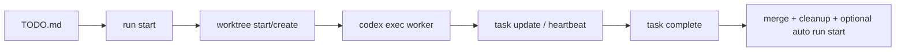

# codex-teams

<p align="center">
  Orchestrate multi-agent coding on git worktrees with explicit lifecycle and state.
</p>

<p align="center">
  
  
  
  
</p>

`codex-teams` is a unified orchestration CLI for teams running parallel coding agents.
It provides an orchestration layer between worker launch and task completion:

- scheduler-ready task selection from `TODO.md`
- lock + PID based runtime safety
- explicit finish flow (`task complete`) for merge + cleanup
- interactive dashboard with emergency controls

## Start here: Codex skill (recommended)

This repo ships an installable Codex skill.

- skill manifest: `skills/.curated/codex-teams/SKILL.md`
- installer path: `skills/.curated/codex-teams`

Install with Codex skill installer (after pushing this repo to GitHub):

```bash
python3 /Users/jaycho/.codex/skills/.system/skill-installer/scripts/install-skill-from-github.py \
  --repo <owner>/codex-teams-cli \
  --path skills/.curated/codex-teams
```

After install, restart Codex to pick up the skill.

Use it as the default workflow:

1. In Codex task prompts, include `$codex-teams` to apply guardrails.
2. For scheduled runs, start tasks with `scripts/codex-teams run start`.
3. Monitor and control execution with `scripts/codex-teams` (TUI).

## Why codex-teams

`codex-teams` is opinionated about the full task lifecycle:

1. Start work from the scheduler (`run start`)
2. Track ownership and heartbeat with explicit runtime state
3. Finish with merge strategy + cleanup guardrails (`task complete`)

This is designed to reduce common multi-agent failure modes: duplicate starts, owner collisions, stale locks, and "done but not merged."

## 60-second quickstart

```bash
# 1) Initialize task domain and state hygiene
scripts/codex-teams task init

# 2) Start ready tasks from TODO.md
scripts/codex-teams run start

# 3) Open live dashboard (default command = status --tui)
scripts/codex-teams
```

Interactive TUI requires:

```bash
python3 -m pip install textual
```

## Entry point

```bash
scripts/codex-teams [--repo <path>] [--state-dir <path>] [--config <path>] <command>
```

No command defaults to the interactive dashboard (`status --tui`).

## System flow



## Command surface

### Status and dashboard

```bash
scripts/codex-teams
scripts/codex-teams dashboard [--trigger <label>] [--max-start <n>]
scripts/codex-teams status [--json|--tui] [--trigger <label>] [--max-start <n>]
```

What you get:

- scheduler readiness and excluded tasks (with reasons)
- runtime state counts and lock snapshots
- TUI controls: run start (`r`), emergency stop (`e`), tab switch (`1` / `2`)
- auto-refresh every 2 seconds
- automatic fallback to text mode for non-interactive runs (CI/tests)

### Task domain

```bash
scripts/codex-teams task init [--gitignore <ask|yes|no>]
scripts/codex-teams task lock <agent> <scope> [task_id]
scripts/codex-teams task unlock <agent> <scope>
scripts/codex-teams task heartbeat <agent> <scope>
scripts/codex-teams task update <agent> <task_id> <status> <summary>
scripts/codex-teams task complete <agent> <scope> <task_id> [--summary <text>] [--trigger <label>] [--no-run-start] [--merge-strategy <ff-only|rebase-then-ff>]
scripts/codex-teams task stop (--task <id> | --owner <owner> | --all) [--reason <text>] [--apply]
scripts/codex-teams task cleanup-stale [--apply]
scripts/codex-teams task emergency-stop [--reason <text>] [--yes]
scripts/codex-teams emergency-stop [--reason <text>] [--yes]
```

Behavior notes:

- `task init` manages `.gitignore` for state path (`ask` default, `yes`, `no`)
- `task complete` does not create commits
- `task complete` requires fully committed worktree and `DONE` task status
- default merge strategy is `rebase-then-ff`; strict mode is `--merge-strategy ff-only`
- `task emergency-stop` wraps `task stop --all --apply` with confirmation

Commit message contract (task worktree):

- format: `<type>: <summary> (<task_id>)`
- allowed types: `feat`, `fix`, `refactor`, `docs`, `test`, `chore`
- final DONE marker commit: `chore: mark <task_id> done`
- avoid generic messages like `update`, `done`, `task complete`

### Worktree domain

```bash
scripts/codex-teams worktree create <agent> <task_id> [base_branch] [parent_dir]
scripts/codex-teams worktree start <agent> <scope> <task_id> [base_branch] [parent_dir] [summary]
scripts/codex-teams worktree list
```

### Scheduler domain

```bash
scripts/codex-teams run start [--dry-run] [--no-launch] [--trigger <label>] [--max-start <n>]
```

Runtime behavior:

- default launches detached `codex exec` workers
- writes PID metadata to `.state/orchestrator/*.pid`
- `--no-launch` keeps start-only mode (state/worktree transitions without worker launch)
- on start/launch failure, scheduler rollback releases owned state/locks and kills spawned background workers
- launch command adds state dir and primary repo via `--add-dir` so workers can run `task update/complete`
- if `runtime.codex_flags` does not set sandbox mode, workers replace `--full-auto` with `--dangerously-bypass-approvals-and-sandbox`
- worker prompt requests `$codex-teams` skill guardrails

## Ready task selection

`run start` and `status` derive ready tasks from `TODO.md`, then exclude tasks with active signals:

- `active_worker`
- `active_lock`
- `owner_busy`
- `deps_not_ready`
- `active_signal_conflict`

This blocks duplicate auto-start even when `main` branch still shows `TODO` rows while work is running in task worktrees.

## Skill files

- `skills/.curated/codex-teams/SKILL.md`: worker execution guardrails

## Bootstrap behavior

- Missing config file is auto-created at `.state/orchestrator.toml`
- Missing `TODO.md` is auto-created with a minimal table template

## Removed legacy surface

Legacy commands intentionally removed:

- `scripts/orch`
- `coord ...`
- `ops ...`
- `run status`

Use `scripts/codex-teams status` and `scripts/codex-teams task ...` instead.

## Tests

```bash
python3 -m unittest discover -s tests -p 'test_*.py'
bash tests/smoke/test_run_start_dry_run.sh
bash tests/smoke/test_run_start_lock_cleanup.sh
bash tests/smoke/test_run_start_after_done.sh
bash tests/smoke/test_run_start_launch_codex_exec.sh
bash tests/smoke/test_run_start_rollback_kills_codex_on_launch_error.sh
bash tests/smoke/test_run_start_scenario.sh
bash tests/smoke/test_task_init_gitignore.sh
bash tests/smoke/test_task_complete_auto_run_start.sh
bash tests/smoke/test_task_complete_clears_pid_metadata.sh
bash tests/smoke/test_task_complete_commit_summary_fallback.sh
bash tests/smoke/test_task_complete_auto_rebase_merge.sh
bash tests/smoke/test_status_tui_fallback.sh
```

## License

MIT. See `LICENSE`.
